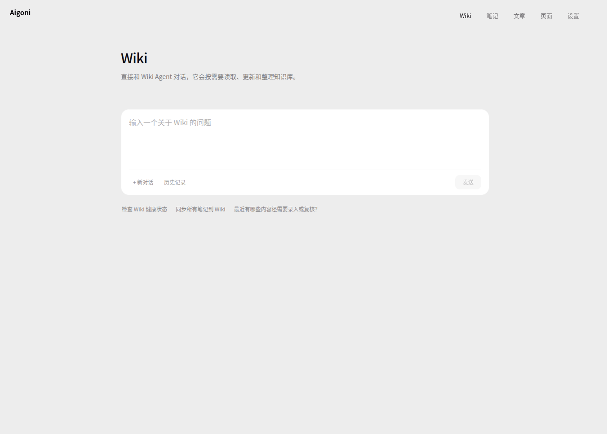
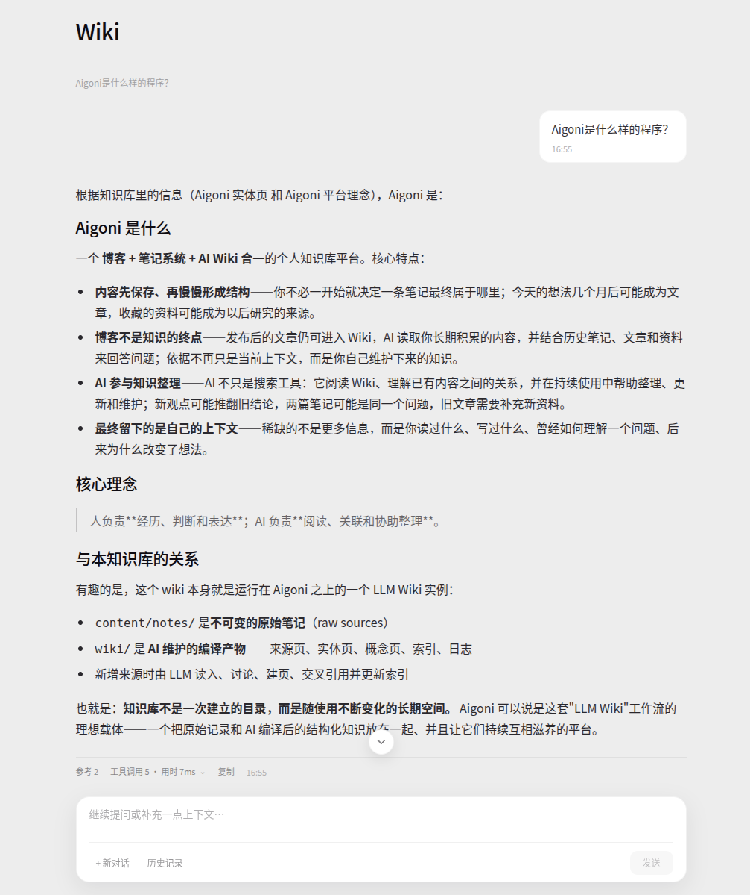
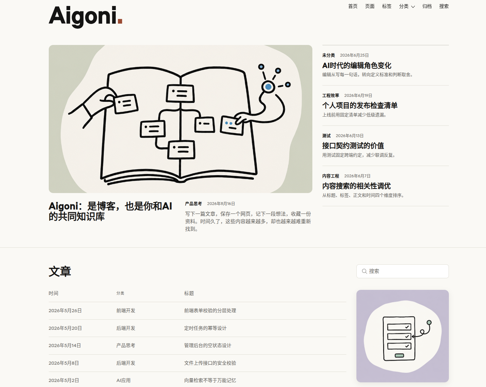
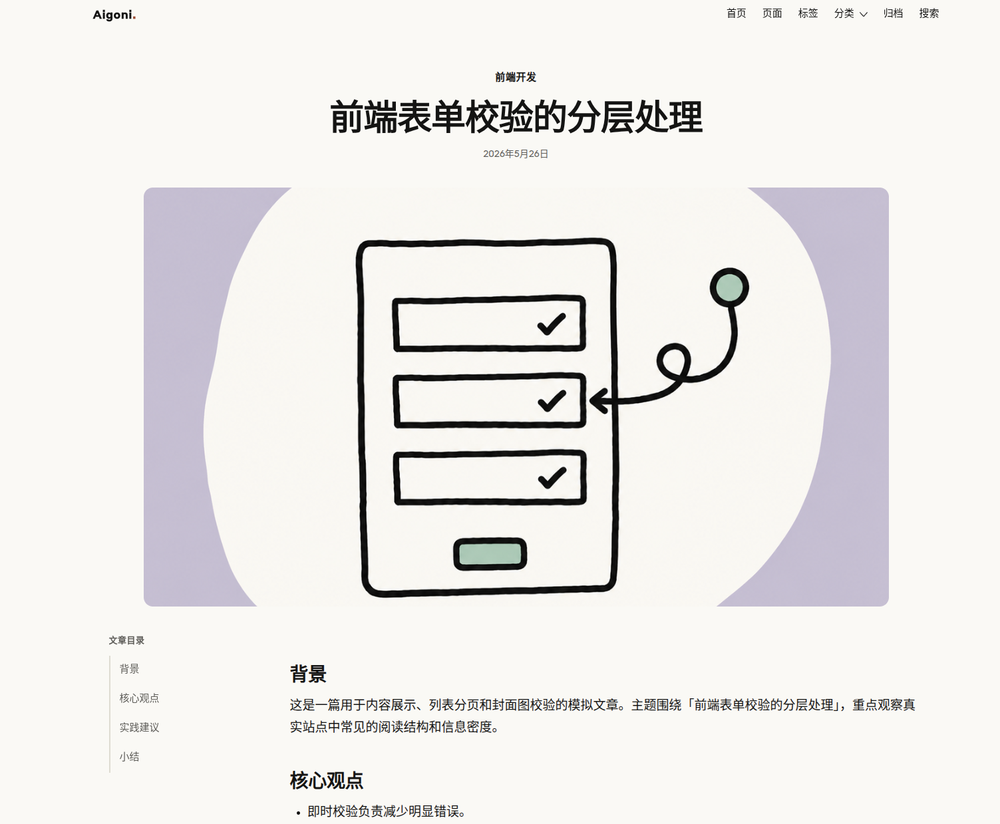
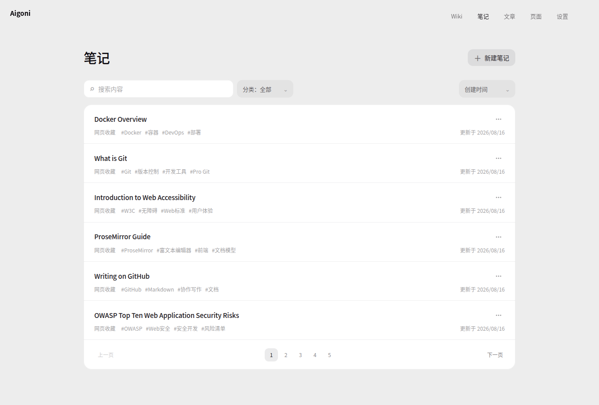
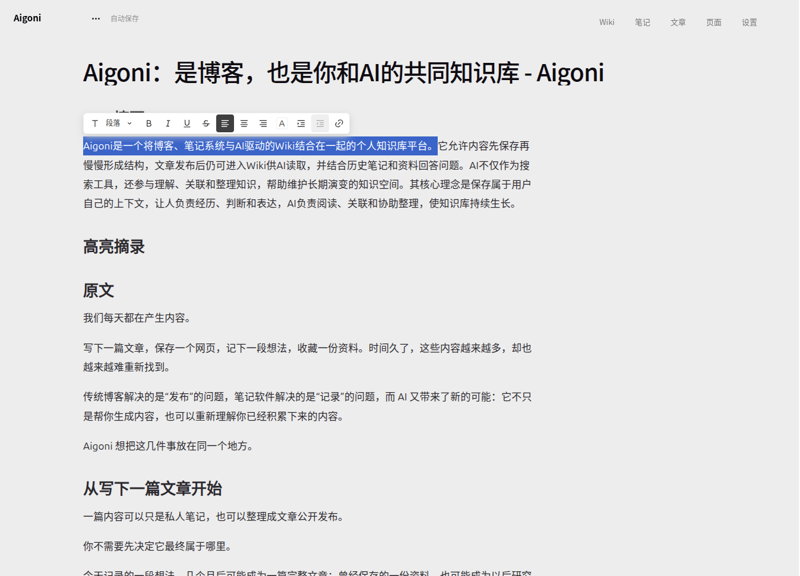

<p align="center">
  <image src=".github/assets/banner.png" />
</p>

<h1 align="center">Aigoni</h1>

<p align="center">
  Aigoni 是博客，也是你和AI共同成长的Wiki知识库。
</p>

<p align="center">
  <a href="./LICENSE"></a>
  
  
  
</p>

<p align="center">
  <a href="#快速开始">快速开始</a> ·
  <a href="#核心能力">核心能力</a> ·
  <a href="#api-与文档">API 文档</a> ·
  <a href="#llm-wiki">LLM Wiki</a> ·
  <a href="#许可证">许可证</a> ·
  <a href="#联系作者">联系作者</a>
</p>

## 为什么是 Aigoni

Aigoni 把「博客」和「LLM Wiki知识库」放在一个“本地MD文件”的系统里：

- 个人笔记：可以将任何知识内容放入笔记中。
- 网页收藏：将任何网页内容通过API存入笔记。
- LLM Wiki：完全遵循 <a href="https://gist.github.com/karpathy/442a6bf555914893e9891c11519de94f">karpathy/llm-wiki</a> 的Agent。
- 博客展示：文章/页面支持公开显示在前台中。
- 品牌官网：基于极简的博客文章系统可以构建任意官网。
- 企业知识库：使用REST API请求LLM WIKI获取答案。
- 自动化SEO站点：配合博客系统及REST API实现每天自动化提交。

它适合个人博客、网页收藏、知识笔记，以及任何需要把 Markdown 内容沉淀为可发布站点和可维护 Wiki 的场景。

如果你想在网页裁切收藏上更方便，可以使用同样开源的 <a href="https://github.com/chinasiro/aigoni-clipper">Aigoni Clipper</a> 浏览器插件。

## 核心能力

| 能力 | 说明 |
|---|---|
| LLM WIKI | 通过向LLM对话，可以获得你真正需要的答案 |
| Markdown | 无数据库依赖，仅本地文件储存，方便迁移/整理 |
| 前后端分离 | 博客前台和后台管理均支持自定义切换前端UI界面。 |
| REST API| 你的任何二开需求几乎都可以完成。 |

## 界面预览


<table>
  <tr>
    <td width="50%" align="center">
      
      <br />
      <strong>Wiki 首页</strong>
    </td>
    <td width="50%" align="center">
      
      <br />
      <strong>Wiki 详情</strong>
    </td>
  </tr>
  <tr>
    <td width="50%" align="center">
      
      <br />
      <strong>博客首页</strong>
    </td>
    <td width="50%" align="center">
      
      <br />
      <strong>博客文章</strong>
    </td>
  </tr>
  <tr>
    <td width="50%" align="center">
      
      <br />
      <strong>后台列表</strong>
    </td>
    <td width="50%" align="center">
      
      <br />
      <strong>后台编辑</strong>
    </td>
  </tr>
</table>

### 前端

你可以通过REST API开发自己的博客、后台界面并将他放到`frontend`目录中并修改`.env`中的设置进行指定。

Aigoni的默认前端界面就是通过REST API进行开发的，你可以基于：<a href="https://github.com/Chinasiro/aigoni-frontend">Chinasiro/aigoni-frontend</a> 进行二次开发。

## 快速开始

### 环境要求

- Go 1.22 或以上。
- 一个可用的 `.env` 文件。

### 最快部署

- 将`二进制文件`上传至服务器，并手动运行一次
- 首次释放文件完毕后，重命名`.env.example`为`.env`，并进行配置
- 完成运行

或

- 将`二进制文件` + `.env` 上传至服务器
- 完成运行

### 二次开发

发给Ai：

```prompt
请将项目 https://github.com/chinasiro/aigoni 下载到当前文件夹中并完成首次运行，创建.env文件，将ADMIN_PASSWORD设置为 8 位以上且不包含常见弱口令的密码。如遇到端口冲突可修改.env中的端口配置。
```

启动服务：

```sh
go run ./cmd/Aigoni
```

默认访问：

- 博客站点：`http://localhost:8080`
- 后台入口：`http://localhost:8080/admin`


## 配置说明

| 配置 | 说明 |
|---|---|
| `.env` | 端口、后台路径、管理员密码、机器 API Key、前端目录、上传白名单、Wiki LLM 配置。含密钥，不应提交。 |
| `config.yaml` | 本地站点配置；缺失时会从二进制内置的 `config.yaml.example` 释放，已有则不覆盖，后台设置页会写回此文件。 |
| `config.yaml.example` | 默认站点配置模板，可提交到仓库。 |
| `WEB_FRONTEND_DIR` / `ADMIN_FRONTEND_DIR` | 留空时使用二进制内置前端；填写路径时使用磁盘自定义前端。 |
| `content/` | Markdown 内容根目录，包含 posts、pages、notes。 |
| `wiki/` | LLM 生成和维护的 Wiki 目录。 |
| `public/uploads/` | 公开上传资源目录。 |

常用环境变量：

| 字段 | 说明 |
|---|---|
| `ADMIN_PASSWORD` | 后台管理员密码，必填，至少 8 位并拒绝常见弱口令。 |
| `ADMIN_PATH` | 后台访问路径，如 `admin`。 |
| `COOKIE_SECURE` | HTTPS 部署建议设为 `true`。 |
| `AIGONI_API_KEY` | 机器 API Key；用于 `/api/content` 内容写入与 `/api/admin/v1/wiki/ask:api` 只读 Wiki Ask，留空时相关机器接口拒绝请求。 |
| `WEB_FRONTEND_DIR` | 公开前台静态目录。 |
| `ADMIN_FRONTEND_DIR` | 后台 SPA 静态目录。 |
| `WIKI_APIKEY` | Wiki Chat / Wiki Ask 使用的模型 API Key；留空时不可用。 |
| `WIKI_BASEURL` | OpenAI-compatible API Base URL。 |
| `WIKI_MODEL` | Wiki Agent 使用的模型名。 |
| `AIGONI_WIKI_ASK_API_ENABLED` | 机器只读 Wiki Ask 接口开关，默认关闭；设为 `true` 才启用 `POST /api/admin/v1/wiki/ask:api`。 |
| `AIGONI_WIKI_ASK_API_RPM` | 机器只读 Wiki Ask 提交接口每分钟请求上限，默认 `60`；只限制 Ask 提交频率。 |
| `AIGONI_WIKI_AGENT_CONCURRENCY` | Wiki Agent 总并发上限，默认 `5`；Admin Wiki Chat 与机器只读 Wiki Ask 共用，`pending/running` 都计入。 |

## 目录结构

```text
cmd/Aigoni/          进程入口，加载 config.yaml/.env 并启动 HTTP Server
internal/            Go 业务代码
  agent/             Eino Wiki Agent、提示词和文件工具
  auth/              单管理员登录、Session、CSRF 与限速
  config/            config.yaml 与 .env 加载/写入
  content/           Markdown 内容模型、解析、仓储和资源服务
  search/            前台与后台搜索
  server/            路由、REST/Admin API、静态资源与 Wiki 适配
frontend/            前台和后台静态资源目录
content/             posts/pages/notes Markdown 数据
public/              uploads 与 robots.txt
wiki/                LLM 生成的 Wiki 页面与 append-only 日志
docs/                REST API 文档与 OpenAPI 契约
```

## API 与文档

| 文档 | 说明 |
|---|---|
| [`docs/restapi_web.md`](docs/restapi_web.md) | 公开只读 REST API，基础路径 `/rest/v1`。 |
| [`docs/restapi_admin.md`](docs/restapi_admin.md) | 后台 Admin REST API，基础路径 `/api/admin/v1`。 |
| [`docs/content-api.md`](docs/content-api.md) | API Key 自动化写入接口，入口 `POST /api/content`。 |
| [`docs/openapi.yaml`](docs/openapi.yaml) | OpenAPI 3 机器可读契约。 |

关键入口：

- `GET /rest/v1/site`：公开站点配置。
- `GET /rest/v1/posts`：公开文章列表。
- `GET /rest/v1/search?q=关键词`：公开文章搜索。
- `POST /api/content`：通过 API Key 创建内容。
- `POST /api/admin/v1/wiki/ask:api`：通过 API Key 提交只读 Wiki Ask 问题（无 write 工具，不会改动 Wiki）。
- `POST /api/admin/v1/session`：后台登录。
- `POST /api/admin/v1/wiki/chat`：启动 Wiki Agent 任务。
- `POST /api/admin/v1/wiki/chat:stream`：流式运行 Wiki Agent。

## LLM Wiki

Aigoni 的 LLM Wiki 完全基于 karpathy/LLM Wiki，通过 Agent 实现无数据库，纯MD文件储存。`content/notes/`对LLM来说是只读入口，它只有操作维护 `wiki/` 的权限。

```text
笔记 -> Agent -> Wiki
```

在维护Wiki时，你可以对Agent下发任何自然语言的指令，例如`同步所有笔记到 Wiki`或`检查 Wiki 健康状态`。
在需要查询时，只需要直接询问即可。

## 安全要点

- 后台写操作需要管理员 Session Cookie 和 `X-CSRF-Token`。
- 后台登录失败同一 IP 连续 5 次会锁定 15 分钟。
- `COOKIE_SECURE=true` 时会话 Cookie 带 Secure 标记，适合 HTTPS 部署。
- 远程图片下载会拦截内网、环回、链路本地、云元数据和 CGNAT 地址。
- `/uploads/`、`/assets/` 不列目录，静态资源带 `X-Content-Type-Options: nosniff`。
- 公开 API 只返回已发布内容，不暴露私人笔记、草稿和后台字段。

## 贡献

欢迎通过 Issue 或 Pull Request 改进 Aigoni。提交前建议：

1. 保持 Go 代码符合 Google Go Style。
2. 使用中文交流沟通即可，保持简洁清晰。

## 致谢

- [CloudWeGo Eino](https://github.com/cloudwego/eino)：Aigoni 的 Wiki Agent 基于 Eino 构建。
- [goldmark](https://github.com/yuin/goldmark)：Markdown 渲染。
- [bluemonday](https://github.com/microcosm-cc/bluemonday)：HTML 内容净化。
- [Linux.do](https://linux.do)：学Ai，上L站。

## 许可证

Aigoni 使用 [MIT License](./LICENSE) 发布。

本项目依赖的第三方组件仍遵循各自许可证。CloudWeGo Eino 是 Apache-2.0 依赖/致谢项，不改变 Aigoni 本身的 MIT 许可证。

## 联系作者

请使用中文沟通即可 `chinasiro@gmail.com`